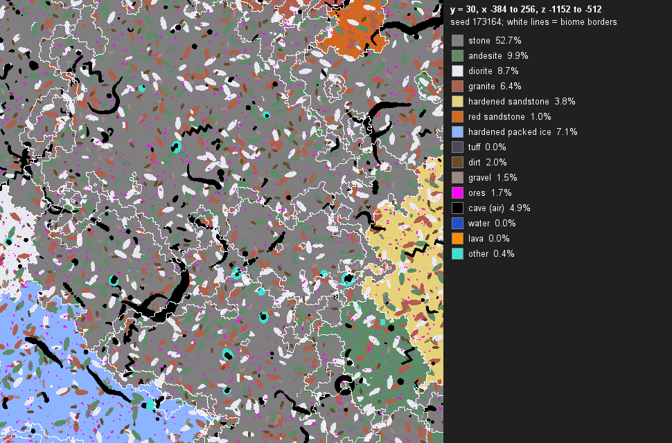
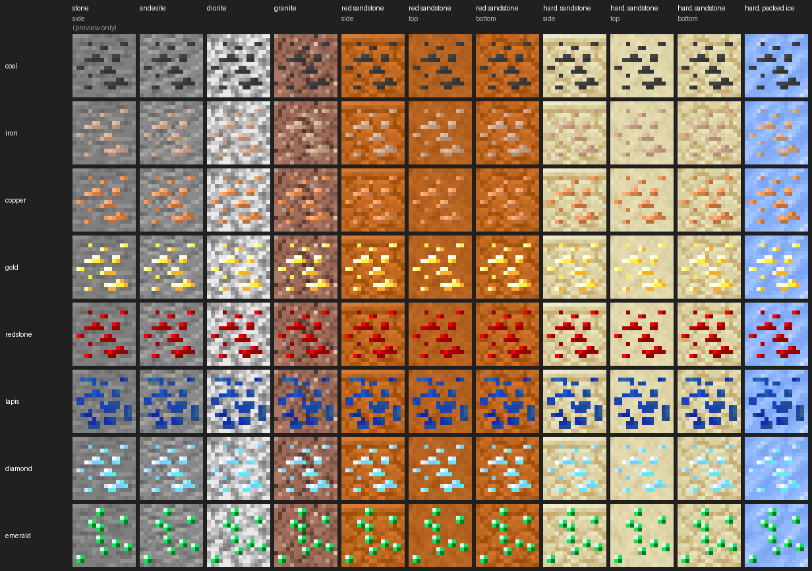
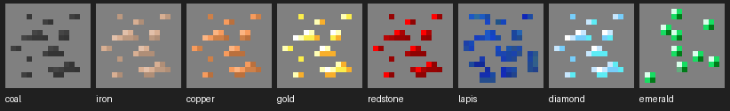

# Worldgen vision

The worldgen phase of Eternal Return. This is the target; the status section further down tracks where things stand.

## Terrain

Overworld terrain with the weirdness of Beta 1.7.3 combined with the large continents and big oceans of Release 1.6.4.

## Biomes

A small biome list: mostly the Release 1.6.4 biomes, plus a few added in later versions. Which later biomes make the cut is the project owner's call. Chosen so far: birch forest, savanna, badlands, dark forest and cherry grove, plus every modern ocean (deep, warm, lukewarm, cold, frozen).

## Caves

Inspired by TheMasterCaver's World. Many cave types:

- spaghetti
- ravine
- ~~maze~~ (dropped, not planned)
- zig-zag
- vertical
- ribbed
- ~~random / combination~~ (dropped, not planned)
- large
- ~~circular room~~ (dropped, not planned)
- spiral
- toroidal room

Cave stone depends on the biome (sandstone caves in deserts; granite, diorite, andesite and others elsewhere), and each stone has its own ore variants. Both are in place (see Biome stone and Ore variants below).

Built: spaghetti, ravine, large, vertical, zig-zag, ribbed, spiral and toroidal room (see The cave engine below). Maze, combination and circular-room caves were dropped from the plan.

No modern cave biomes (lush caves, dripstone caves, deep dark) and no deepslate. The full modern height (-64 to 320) is used.

## Scope

- Overworld only for now. The Nether and the End are left alone.
- Everything lives in this one mod, in its own worldgen package (`com.eternalreturn.worldgen`).
- Every feature gets its own on/off toggle in `config/eternalreturn.json`.
- Follow the repo's existing conventions: tags and data under `data/eternalreturn`, the existing config style, and README updates alongside each feature.

## Compatibility

Must keep working alongside Sodium, Nostalgic Tweaks and Moderner Beta.

## Current setup

Worldgen comes from Moderner Beta (`moderner-beta-fabric-5.0.0-alpha.2+1.21.1`) with this mod's own preset on top: World Type "Eternal Return" on the create-world screen (world preset `eternalreturn:eternal_return`, Moderner Beta settings preset `eternalreturn:eternal_return`). Moderner Beta is a runtime-only dependency in the dev environment, so the build never depends on it.

The preset is all data. Without Moderner Beta installed, the world type and its noise settings are skipped at load time (Fabric load conditions), the jar still launches, and worlds still load. The `gametestNoModernerBeta` run checks this.

## Status

- Phase 1 (investigation): done. Findings below.
- Phase 2 (preset, fish tags, terrain): done. Biome list, no cave biomes, no deepslate, full -64 to 320 height, terrain tuned in two passes (the second after playtesting).
- Phase 3, part 1 (cave engine): done. The shared engine, debug tools and six tunnel types; the old caves are off in Eternal Return worlds; trial chambers removed there. Ores are still vanilla's.
- Phase 3, part 2: done. Spiral and toroidal-room caves; maze, combination and circular-room caves dropped.
- Phase 4, part 1 (biome stone): done. Each biome's stone from under the topsoil to bedrock, and two hardened blocks.
- Phase 4, part 2 (ore variants): done. Every ore in every host stone, with old-style textures.
- Phase 4, part 3 (biomes and mineshafts): done. Cherry groves, every modern ocean (so ocean monuments), and mineshafts built from their biome's wood.

## The Eternal Return preset

`tools/worldgen/build_preset.py` builds it from Moderner Beta's Release 1.6.4 preset (read straight from the Moderner Beta jar in the Gradle cache) and applies the changes below. The terrain knobs and the biome stone table are in `tools/worldgen/knobs.json`: edit them, run `python tools/worldgen/build_preset.py tools/worldgen/knobs.json`, and the files under `src/main/resources` are rewritten.

| File | What it is |
|---|---|
| `data/eternalreturn/moderner_beta/settings_preset/eternal_return.json` | the Moderner Beta settings: biome layers, terrain knobs, no cave biomes, no deepslate |
| `data/eternalreturn/worldgen/noise_settings/eternal_return.json` | Moderner Beta's `overworld_256` noise settings with the height opened up to -64..320, plus the biome stone surface rules (from `biome_stone` in the knobs) |
| `data/eternalreturn/tags/block/biome_host_stones.json` | every host stone in the biome stone table (see Biome stone) |
| `data/eternalreturn/worldgen/world_preset/eternal_return.json` | the world type; vanilla Nether and End |
| `data/minecraft/tags/worldgen/world_preset/normal.json` | lists the world type on the create-world screen (optional entry) |
| `data/eternalreturn/moderner_beta/settings_preset_category/`, `data/eternalreturn/tags/moderner_beta/`, `data/moderner_beta/tags/moderner_beta/settings_preset_category/selectable.json` | lists the preset in Moderner Beta's own preset picker, with its icon (`assets/eternalreturn/textures/gui/moderner_beta_settings_preset/`) |
| `data/minecraft/tags/block/stone_ore_replaceables.json`, `data/minecraft/tags/block/deepslate_ore_replaceables.json` | move tuff from the deepslate ore tag to the stone one, so ores that land in tuff blobs use their stone variant |
| `structure_modifiers.removed` in the settings preset | `minecraft:trial_chambers`: no trial chambers in Eternal Return worlds |

**Biomes.** The 1.6.4 land pool (desert, forest, extreme hills, swampland, plains, taiga, jungle, each listed twice) plus birch forest, savanna, badlands, dark forest and cherry grove (each listed once). River, frozen river, beach, ice plains, ice mountains, mushroom island, and the hills and shore rules are unchanged from 1.6.4. Birch forest, savanna, badlands and cherry grove get hills variants through the hills layer; dark forest has none, as in later versions.

**Oceans.** Every modern ocean, with the steps Moderner Beta's Release 1.17.1 preset uses: right after the mushroom island layer, ocean whose four neighbours are ocean becomes deep ocean (Release 1.7's deep ocean layer); beaches and rivers treat deep ocean as ocean; and last, an ocean temperature noise (Release 1.13's) makes each ocean or deep ocean frozen, cold, plain, lukewarm or warm, softening warm and frozen next to land (deep warm stays as shallow as warm, as in vanilla, where there is no deep warm ocean). The frozen oceans 1.6.4 puts beside its ice plains stay frozen. Over 8,000 x 8,000 blocks of the test seed, oceans are about 40 percent of the area: ocean 9.9, deep ocean 7.7, cold 6.9, lukewarm 4.6, deep cold 3.3, deep lukewarm 2.7, warm 2.0, frozen 1.1 and deep frozen 0.6 percent. Every ocean's height is set in the preset, with Moderner Beta's 1.17.1 values (`-1.0;0.2`, deep ones `-1.8;0.2`, and the deep warm ocean `warm_ocean*deep` as shallow as warm), so the sea floor has no steps where the temperature changes. Without those lines the deep cold, deep frozen and deep lukewarm oceans and the deep warm one, which Moderner Beta's height table leaves out, took the default land height and rose into hills that still reported an ocean biome, with ocean ruins and shipwrecks on dry land. Deep oceans are deeper and bring ocean monuments (35 within 4,000 blocks of spawn); vanilla's ocean ruins, shipwrecks and buried treasure follow the ocean types, and Moderner Beta's smaller ocean shrines turn up in every ocean.

**Cherry groves** are a normal entry in the land pool, about 2.4 percent of the area (as much as badlands). Moderner Beta gives them a plateau height, which Eternal Return's terrain knobs turned into sheer flat-topped blocks rising from the sea; `build_preset.py` sets them to a raised, rolling highland instead (`0.35;0.6`, hills `0.6;0.7`).

The later biomes work cleanly next to Moderner Beta's own: Moderner Beta ships height settings for them and a badlands surface (terracotta bands and red sand), and their vanilla grass and foliage colours and mob spawns apply unchanged. Nothing had to be skipped. Share of land on the test map: ice plains 19% (the same as plain 1.6.4, from its cold climate band), taiga 13%, swampland 11%, forest 11%, desert 8%, plains 7%, badlands 6%, jungle 6%, extreme hills 6%, dark forest 4%, savanna 4%, birch forest 4%, mushroom island 0.2%. The four later biomes together are about a fifth of the land. (Those shares are from before cherry groves and the modern oceans; adding a biome to the pool reshuffles where every land biome lands, so all coordinates in the README checklist were found again.)

**No cave biomes.** The cave biome provider is `moderner_beta:none`, so lush caves, dripstone caves and the deep dark never generate (and so no ancient cities either).

**No deepslate.** Moderner Beta's deepslate layer is off, so below y=0 the stone carries on unchanged (plain stone, or the biome's stone; see Biome stone). Vanilla still scatters tuff blobs below y=0, and an ore that lands in tuff would take its deepslate variant. Tuff is added to `stone_ore_replaceables` and taken out of `deepslate_ore_replaceables` (that file replaces vanilla's, leaving only deepslate), so those ores are always the stone kind; the second change matters once caves expose tuff to air, because vanilla's ore placer then falls back to the deepslate target. Both tag changes apply to every world: in a vanilla world, ores inside tuff blobs use the stone variant too. Trial chambers, which have a little cobbled-deepslate rubble, no longer generate in Eternal Return worlds. Moderner Beta's optional "Deepslate Blobs" datapack would still add deepslate if someone turned it on.

**World height.** -64 to 320, all of it used. Bedrock at -64, solid stone with caves and ores from there to the surface, sea level 63, most land between 65 and 90, hills to about 115 and the tallest mountains around 180. Moderner Beta's own 1.6.4 presets stop terrain at y=128; this preset lets it go higher, with room to spare up to 320. Don't turn on Moderner Beta's "Reduced Height" datapack with this preset: it moves the floor to y=0 for every world.

## Terrain tuning

Goal: Beta 1.7.3's weird, dramatic land at Release 1.6.4's continent and ocean scale. All maps are seed 173164, 4096 x 4096 blocks centred on 0,0, in `docs/worldgen-maps/`.

| | Beta 1.7.3 | Release 1.6.4 | Eternal Return |
|---|---|---|---|
| Water (share of the map) | 42.1% | 64.7% | 61.1% |
| Ocean biomes | 0% (Beta has none) | 44.5% | 44.6% |
| Landmasses bigger than a chunk | 337 | 200 | 135 |
| Land height: median / 90th / 99th percentile / max | 71 / 84 / 105 / 122 | 68 / 78 / 104 / 124 | 71 / 91 / 113 / 177 |
| Land roughness (average height change between points 4 blocks apart) | 1.4 | 1.3 | 2.2 |
| Land mix: flat / rolling / hilly / mountains / extreme | 29 / 51 / 18 / 2 / 0% | 47 / 34 / 16 / 4 / 0% | 17 / 40 / 37 / 7 / 0.1% |
| Land with an overhang (576 sampled chunks) | 0.5% | 0.6% | 0.8% |

The land mix sorts every mostly-land 32 x 32 block square by its relief (highest minus lowest ground): flat under 8 blocks, rolling 8-19, hilly 20-39, mountains 40-79, extreme 80 or more.

Beta's world is a maze of lakes, inlets and islands with no real oceans, and most of its land rolls. 1.6.4 has real oceans and continents, but half its land is flat. Eternal Return keeps 1.6.4's oceans and coastlines (same ocean-biome share) and makes the land roll and climb almost everywhere: mostly rolling and hilly ground, mountains up to about y 180, Beta-like cliffs and the odd overhang.

**Second pass (after playtesting the first).** The first pass (below) gave mountains up to y 307, 200-block spires and many floating islands, and the change from plain to spire was sudden. That came from multiplying each biome's own height range by 2.5: extreme hills, hills variants and mushroom islands became far more rugged than deserts (median relief 64 blocks against 12 on the land-rich test area). The second pass cuts that multiplier to 0.45 and adds a fixed 0.85 to every land biome instead, so every biome gets a similar Beta-style roll and the hilly biomes are only somewhat hillier (median relief 10 to 27 blocks by biome; Beta 9 to 15). The land lift is roughly halved too.

Swamps stay flat (median relief 2): they sit below the "land only" cut-off, as in 1.6.4.

The knobs, most important first (Moderner Beta's names in brackets):

| Knob | Shipped (first pass; 1.6.4) | What it does |
|---|---|---|
| Boost land only (`forced_biome_height.modifyOnlyPositiveDepth`) | true (true; false) | The boosts below apply to land biomes only. Ocean floors keep their 1.6.4 depth, which is what keeps 1.6.4's coastlines and ocean sizes. |
| Biome contrast (`scaleWeight`) | 0.45 (2.5; 1) | Multiplies each biome's own ruggedness. High values make extreme hills and hills variants far wilder than plains; low values make every biome roll alike. |
| Base ruggedness (`scaleOffset`) | 0.85 (0.6; 0) | Ruggedness added to every land biome: rolling hills, cliffs, overhangs. Around 1.0 and above, floating rock becomes common. |
| Land height (`depthWeight`, `depthOffset`) | 1.2, 0.2 (1.6, 0.5; 1, 0) | How high land sits above the sea. Plains sit around y 70. |
| Terrain ceiling (noise settings height) | 320 (320; 128) | Where terrain has to stop. Not reached any more, but leaves room. |
| Depth noise strength (`noise_landmass.depth.influence`) | 0.2 (0.2; 0.2) | Beta's 1.0 breaks the coastline into islets; 0.35 made little difference. |
| Sampled scale noise (`noise_landmass.scale.sample`) | off (off; off) | Beta's random roughness. It also roughens ocean floors, so it scatters islets across the oceans. |
| Vertical stretch (`noise_scale.stretchY`) | 12 (12; 12) | Lower values (9) give taller, thinner spikes. |

Second-pass variants, on the 2048 x 2048 area centred on 0,-1024 (the land-rich part of the map; `MAP_CENTRE=0,-1024 MAP_CLOSEUP=942,-420 MAP_SLICE_Z=-1328`). Contrast is `scaleWeight`, base is `scaleOffset`, lift is `depthWeight` / `depthOffset`:

| Variant | Contrast, base, lift | Land: median / 99th pct / max | Flat / rolling / hilly / mountains / extreme | Overhangs | Relief: extreme hills vs desert |
|---|---|---|---|---|---|
| Beta 1.7.3 | (no biome heights) | 71 / 101 / 122 | 28 / 54 / 16 / 2 / 0% | 0.9% | 9-15 in every biome |
| First pass | 2.5, 0.6, 1.6 / 0.5 | 78 / 202 / 307 | 7 / 23 / 36 / 24 / 10% | 6.8% | 64 vs 12 |
| Even | 0.86, 0.98, 1.3 / 0.25 | 73 / 137 / 207 | 11 / 28 / 40 / 19 / 2% | 4.1% | 34 vs 13 |
| Even, lower | 0.8, 0.8, 1.3 / 0.25 | 72 / 125 / 202 | 14 / 34 / 38 / 12 / 1% | 1.9% | 30 vs 10 |
| Flatter contrast | 0.6, 0.9, 1.3 / 0.25 | 72 / 123 / 171 | 14 / 34 / 39 / 13 / 1% | 2.6% | 29 vs 11 |
| Even more | 0.45, 1.0, 1.3 / 0.25 | 72 / 123 / 175 | 13 / 33 / 40 / 14 / 0% | 3.0% | 28 vs 12 |
| Tame | 0.7, 0.7, 1.2 / 0.2 | 72 / 115 / 153 | 17 / 41 / 34 / 9 / 0% | 1.0% | 28 vs 9 |
| **Even more, tame (shipped)** | 0.45, 0.85, 1.2 / 0.2 | 72 / 115 / 162 | 15 / 39 / 37 / 9 / 0% | 1.0% | 26 vs 10 |

Also tried on the area centred on 0,0: Beta's sampled scale noise on top of "even" (influence 0.4) gave about the same land but 123 landmasses instead of 44 (islets across the oceans), and depth noise 0.35 changed almost nothing.

For a little more drama, the "even more" numbers (`depth_weight` 1.3, `depth_offset` 0.25, `height_scale_offset` 1.0) keep the same evenness with more cliffs and some floating rock.

**First pass (superseded).** Same goal, judged on the maps alone. Variants on the 2048 x 2048 area centred on 0,0:

| Variant | Change from 1.6.4 | Land height: median / 99th pct / max | Roughness | Overhangs | Landmasses | Verdict then |
|---|---|---|---|---|---|---|
| Beta noise on 1.6.4 | sampled scale on, no land boost | 70 / 119 / 202 | 2.2 | 0.5% | 171 | islets everywhere, little drama |
| Mild boost | land only; height 1.5 / 0.3, scale 2.0 / 0.4 | 72 / 203 / 253 | 3.0 | 5.1% | 36 | good but tame |
| Mild boost + Beta noise | as above, sampled scale 0.4 | 72 / 205 / 269 | 3.3 | 7.8% | 122 | more islets, same drama |
| First pass | land only; height 1.6 / 0.5, scale 2.5 / 0.6 | 76 / 227 / 307 | 4.0 | 8.6% | 33 | chosen; too extreme in game |
| First pass + Beta noise | sampled scale 0.2 | 76 / 227 / 307 | 4.1 | 8.5% | 68 | more islets, no gain |
| First pass, stretch 9 | stretchY 9 | 76 / 273 / 311 | 5.2 | 9.9% | 94 | spikier, more islets |
| Amplified-lite | land only; height 2.0 / 0.8, scale 3.0 / 0.8 | 80 / 263 / 310 | 5.2 | 8.5% | 28 | wilder |
| Amplified | land only; height 2.0 / 1.0, scale 4.0 / 1.0 | 86 / 298 / 314 | 6.7 | 13% | 29 | mountains everywhere |

(First-pass overhang numbers came from 144 sampled chunks and are noisier than the 576-chunk numbers used now.)

### Map tool

`./gradlew generateWorldMaps` renders all three presets (about 15 minutes; add `-PworldmapHalf=1024` for a 2048-block area in a few minutes). `./gradlew runWorldmapEternalReturn` (or `runWorldmapBeta`, `runWorldmapRelease164`) renders one. Each run generates a world headlessly at seed 173164 and writes to `docs/worldgen-maps/<preset>/`:

- `height.png`: shaded height (blue water, green lowland, brown hills, grey and white mountains)
- `biomes.png`: biomes, with a legend and each biome's share
- `land.png`: land (green) against water (blue)
- `slice.png`: a side view (full height) through the row with the most high ground
- `closeup.png`: a 512-block close-up of the area with the highest ground
- `stats.json`: the numbers in the tables above, plus each biome's median relief (`terrain_mix.median_relief_by_biome`)

Options: `-PworldmapOut=<dir>` writes to `<dir>/<preset>/` instead; `-PworldmapCentre=x,z` moves the mapped area; `-PworldmapCloseup=x,z` and `-PworldmapSliceZ=z` pin the close-up and side view, so different settings can be compared on the same ground.

`python tools/worldgen/compare_maps.py` rebuilds `overview.png` (height and land maps with the headline numbers) and `slices_compared.png` (the three side views). `python tools/worldgen/variants.py <variants.json>` renders a list of knob variants into `build/worldgen-variants/<name>/eternal_return/`, prints the stats for each, then restores the shipped preset; the `HALF`, `MAP_CENTRE`, `MAP_CLOSEUP` and `MAP_SLICE_Z` environment variables pass the options above.

## The cave engine (phase 3)

Eight cave types, carved only in Eternal Return worlds. Code: `com.eternalreturn.worldgen.caves`.

### Which worlds, and the old caves

- **Only Eternal Return worlds.** A world counts as Eternal Return when its generator uses this mod's noise settings (`eternalreturn:eternal_return`), which only the Eternal Return preset references. Moderner Beta rebuilds the settings object when a preset overrides the sea level (ours does), but it keeps the noise router object, so the check compares that (`CaveWorlds`, told to every carver through `CarverContextMixin`).
- **The old caves are off there.** Every carver runs through `ConfiguredCarver.carve`, under vanilla's generator and Moderner Beta's alike (Moderner Beta swaps in its Beta-style caves and canyons just before that call). In Eternal Return worlds `ConfiguredCarverMixin` skips every carver that isn't this mod's: vanilla's cave and canyon carvers, Moderner Beta's replacements, and any other mod's carvers. Each carver is seeded on its own, so skipping one never moves another's caves.
- **Everything else is untouched.** In vanilla, other Moderner Beta presets and flat worlds the cave carver does nothing and nothing is skipped. The control fingerprints prove it (see Tests).
- **Toggles.** `worldgen.caves.enabled` turns the new caves off; `worldgen.caves.oldCaves` brings the old ones back in Eternal Return worlds. With the new caves off and the old ones on, an Eternal Return world comes out block for block as it did before the cave engine.

### How a cave is carved

- One carver, `eternalreturn:caves` (`CaveSystemCarver`), attached to every overworld biome after the biome's own carvers. The generator calls it for the chunk being carved once per nearby source chunk (up to 8 chunks away), with a random seeded from the world seed and that source chunk; Release 1.6.4's caves worked the same way.
- From that seed each type gets its own random (salted with the type's name), so turning a type off or changing its weight leaves the other types' caves where they were. The type decides how many caves start in the source chunk (weight per 100 chunks), places each start in the chunk at a y in its depth range, and simulates the whole cave. Only the parts inside the chunk being carved are written.
- Shapes stay within 120 blocks (per axis) of their source chunk's centre, so every chunk a cave touches also sees its source: caves line up across chunk borders, and the result doesn't depend on which chunks generate first.
- Shared building blocks (`CaveBuilder`, `Tunnel`, `ChunkCarver`): ellipsoids with an optional flat floor, any custom shape, and a winding tunnel walker using Release 1.6.4's wander maths. A new type is one class plus one line in `CaveTypes`.

`ChunkCarver` holds the rules every type follows:

- Only blocks in the block tag `eternalreturn:carvable` are replaced. It contains vanilla's `#minecraft:overworld_carver_replaceables` (all overworld stones, dirt, sand, terracotta, gravel, sandstone, snow, packed ice and more) plus every biome host stone, listed outright: `#eternalreturn:hardened_stones`, red sandstone, sandstone, packed ice, granite, diorite and andesite. Bedrock and anything outside the tag stay.
- Nothing is carved in the bottom layer or within 8 blocks of the top (vanilla's limits).
- At or below the lava level (vanilla's 8 blocks above the floor: y -56) carved blocks become lava, above it cave air.
- A shape is skipped in a chunk when water, or lava above the lava level, lies in or next to its box: Release 1.6.4's rule, which keeps caves from breaching oceans, rivers and lakes. Water just across the chunk's edge is read from the generator's height map (the ocean or river surface there), because the neighbouring chunk may not exist yet. Vanilla's carver tag contains water, but this rule means water is never carved.
- Large caverns use a per-block form of that rule instead: each block next to water (or such lava) is left standing and the rest is carved, so a giant cavern near the sea keeps a wall of rock rather than losing a whole lobe at a chunk border.
- When grass or mycelium is carved, the dirt under it becomes the same block, as vanilla does.

### The types

Weight is caves starting per 100 chunks; spaghetti counts cave systems. Start y is where a cave begins (tunnels wander beyond it). Radius ranges are in blocks.

| Type | Looks like | Weight | Start y | Radius |
|---|---|---|---|---|
| `spaghetti` | Release 1.6.4's caves, with its sizes and maths. A system is one chunk holding a cluster of starts (1.6.4's rand(rand(rand(40) + 1) + 1), at least one), each at its own spot and depth, deeper ones more likely. One start in four opens a round, flattened room (radius 2.5 to 8.5, half as tall) with one to four tunnels out of it. A tunnel runs 85 to 112 blocks, 1.5 blocks in radius at its ends and swelling to 1.5 to 4.5 in the middle; one in ten is widened up to four times. Flat floors, rough walls, one tunnel in six keeps its slope for longer. Every tunnel wider than 1 (most of them) forks somewhere in its middle half into two thinner tunnels heading left and right, as in 1.6.4: that, with many starts per system, is what makes the caves a maze. | 6.7 | -58 to 85 | 1.5 to 4.5 (radius at the ends, and at the widest for an ordinary tunnel) |
| `ravine` | Release 1.6.4's ravines: long, narrow canyons three to four times as tall as they are wide, with vertical, jagged walls (the width changes every one to three blocks of height). One in four is a large ravine, wider, taller and grown both ways from its start. Shallow ones open to the surface. | 2 | -30 to 45 | 2.5 to 4.5 (half-width; large ×1.5) |
| `large` | A big chamber: a stretched main body with lobes of different sizes and heights around it, so the walls are uneven, and three or more forking tunnels leading out. Floor and ceiling follow smooth noise (shapes about 24 and 12 blocks across): the floor rises into mounds and sinks into hollows, the ceiling bulges a little, so nothing is flat. The radius follows a bell curve with a long tail (`typicalRadius` × e^(0.35 × a normal random), kept within the range): about a quarter are under 20, most are 20 to 35, one in seven is 35 to 50, about one in 45 passes 50 and one in 250 passes 65. Big caverns get more lobes and exits and grow less in height than in width: one of radius 76 came out about 190 blocks across and 55 tall. The deepest have lava pools in their hollows. | 1 | -48 to 15 | 12 to 80, typical 25 (main chamber) |
| `vertical` | Steep connections between levels. Three in five are shafts dropping 20 to 60 blocks with a slight drift and a bulging wall; the rest are steep tunnels at 50 to 75 degrees. Short side tunnels leave the top and bottom so they join the caves around them. | 8 | -20 to 60 (the top) | 2.5 to 4.5 |
| `zigzag` | Constant-width tunnels made of equal straight segments (6 to 14 blocks) turning the same sharp angle (70 to 110 degrees) left and right in turn, each segment with its own gentle slope. | 5 | -50 to 50 | 1.5 to 2.5 |
| `ribbed` | Gently curving tunnels whose width pulses 35 to 55 percent above and below the base every 5 to 9 blocks: wide bulges between rings of rock. | 5 | -50 to 50 | 2.0 to 3.5 (base) |
| `spiral` | A helical tunnel winding two to four turns, clockwise or anticlockwise, around a vertical axis while dropping 30 to 70 blocks at a steady rate, with a solid column of rock in the middle. Each turn drops at least enough to leave rock between the coils. A forking tunnel leaves each end, so it joins the caves around it. | 0.6 | -20 to 60 (the top) | tube 2.0 to 3.0; size (coil radius, axis to the middle of the tube) 7 to 11, always at least the tube + 4 |
| `toroidal` | A donut-shaped room lying flat (one in four tilted 15 to 35 degrees) around a pillar of rock standing in the hole from floor to ceiling. The ring's cross-section is a little wider than tall, with a flat floor; two or three forking tunnels lead out of the outer wall. | 0.5 | -45 to 30 | tube 3.5 to 5.5 (half the ring's width); size (ring radius, centre to the middle of the ring) 9 to 15, always at least the tube + 4 |

The settings that matter most for how much cave there is: `worldgen.caves.density` (multiplies every weight), the spaghetti weight (most of the cave volume) and its radius range, then the large-cave weight and `typicalRadius` (rare but big). Spirals and toroidal rooms are the rarest types (one per 170 and 200 chunks); their weights decide how often you find one, and `minSize`/`maxSize` their overall size.

The type settings changed after playtests (thicker 1.6.4 tunnels, bell-curve caverns, thicker shafts, then 1.6.4's forks and frequency). Config files written for older defaults are reset to the new type defaults once, through `worldgen.caves.typesVersion`.

### Density

Share of the underground (everything below the ground surface) that is open, over a land square of 24 x 24 chunks (from -1472, -1344; seed 173164):

| Depth | New caves | Old caves, same terrain | Release 1.6.4 world |
|---|---|---|---|
| y -64 to -49 | 4.0% | 3.4% | 3.2% |
| y -48 to -33 | 6.4% | 4.8% | 5.1% |
| y -32 to -17 | 7.4% | 5.8% | 7.4% |
| y -16 to -1 | 7.0% | 5.6% | 6.2% |
| y 0 to 15 | 8.0% | 6.8% | 5.4% |
| y 16 to 31 | 6.6% | 5.0% | 4.1% |
| y 32 to 47 | 4.6% | 3.7% | 3.4% |
| y 48 to 63 | 2.2% | 2.9% | 1.1% |
| y 64 to 79 | 1.1% | 3.1% | 0.2% |
| **All** | **5.27%** | **4.55%** | **4.53%** |

"Old caves" are Moderner Beta's 1.6.4-style caves on the identical terrain (the twin dimension with the engine off); the Release 1.6.4 world is Moderner Beta's own preset (its terrain is lower, hence the empty top rows). The new caves carry a little more in total (about a sixth more), mostly from 1.6.4's forking spaghetti at full frequency; they are a little emptier under hills and mountains. The spirals and toroidal rooms add 0.13 points (5.14% without them).

### Timing

Chunk generation up to the carving step, one chunk at a time, same squares with the engine on and off (overworld and twin dimension, swapped between rounds), 392 chunks each:

| | ms per chunk |
|---|---|
| No caves | 63.8 to 69.1 |
| New caves | 68.2 to 71.0 |
| Old caves (Moderner Beta's) | 68.1 to 72.4 |

(Ranges over the last three runs; the totals move by several ms with the machine's load.) Time spent inside the cave carver: 6.9 to 7.2 ms per chunk with all eight types (each chunk simulates the caves of the 289 chunks around it); 5.7 to 7.2 ms with the first six in earlier runs. The spiral and toroidal room add nothing measurable: on identical terrain (overworld and twin, alternating which goes first, 432 chunks each) the carver took 10.35 and 10.44 ms per chunk with them, 10.50 and 10.25 without, in two runs. The new caves cost about the same as the old ones. Totals move by a few ms between runs with the machine's load. The new caves cost about the same as the old ones.

### Dev options

- `debugForceCaveType`: a type id, and only that type is carved, at a high rate (spaghetti 25 systems per 100 chunks; vertical, zigzag and ribbed 60; spiral 20; toroidal 15; ravine 10; large 4).
- `debugLogCaveStarts`: appends `type,x,y,z` for every cave start to `eternalreturn-cave-starts.csv` in the game folder as chunks generate. Teleport to any line to stand inside that cave.

### Cave maps

`./gradlew runWorldmapCaves` (part of `generateWorldMaps`) writes to `docs/worldgen-maps/caves/`:

- `slices.png`: the land square cut at y -50, -20, 20 and 50, new caves next to the old ones on the same terrain (black = cave). `slice_y*.png` are the new-cave slices on their own.
- `gallery.png`: each type forced in its own 128 x 128 block square, seen from above (colour = height of the highest cave block) and from the side.
- `shapes.png`: one spiral and one toroidal room from the gallery squares, each drawn the way its shape shows: the spiral from the side (cave counted through it: the tube swings left and right as it drops, the column stands in the middle) and from above (coloured by height); the room cut flat through its middle (the ring around the pillar) and cut upright through its centre.
- `giant_cavern.png`: a side view through the biggest cavern on land within 5,000 blocks of 0,0. The map tool finds it without generating the area: it replays the seed Moderner Beta hands the cave carver for each chunk and the cavern's radius draw, checks the replay against the caverns the carver actually logged, then generates that one cavern.
- `caves.json`: the density numbers, real cave starts in the land square (used for the README checklist), the cavern radius counts and biggest caverns, and the giant cavern's measured size.

### Trial chambers

Removed in Eternal Return worlds only: the preset lists `minecraft:trial_chambers` in Moderner Beta's `structure_modifiers.removed`, which drops the structure set from that world's placement. Nothing changes in other worlds. In Eternal Return worlds this also means no breezes, trial spawners, vaults, trial keys, heavy cores or maces. The structure test counts starts over an 8192-block square: none in Eternal Return, 222 in a vanilla world and 177 in a Moderner Beta 1.6.4 world.

### Tests

- `runGametestCaves` (Eternal Return with a twin dimension that has the same generator):
  - per type, forced, in a square of its own: caves exist; the open share is in a sane range; no gaps in the bedrock floor, no cave air at or below the lava level, no lava above it, nothing within 8 blocks of the top; no cave block touches an ocean, river or lake; cave borders line up across chunk edges as well as inside chunks; the same chunk generated first in one dimension and last in the other is identical; every logged start is of that type and in its depth range;
  - shape checks for the two newest types, on every spiral and room lying wholly inside its square (found by replaying the seed, `CaveReplay`): each spiral is open along its planned helix (which drops at a steady rate) and the 3 x 3 column on its axis is solid; each toroidal room is open all round the middle of its ring and its hole (checked in the ring's own plane, so tilted rooms count) is solid rock;
  - every block of `eternalreturn:carvable` is carved, bedrock and obsidian aren't, a shape beside water is skipped, lava at and below the lava level;
  - default density and the timing above.
  - "Cave" in these checks is any air below the ground (the generator's own height for the column), or lava at the lava level. The carvers write cave air, but a 16 x 16 x 16 chunk section left with nothing but cave air reads back as plain air, which a giant cavern can do.
- `runGametestEternalReturnOldCaves`: new caves off, old caves on: carved terrain matches the fingerprint recorded before the cave engine.
- Control fingerprints, unchanged: vanilla, Moderner Beta 1.6.4 amplified (debug tunnel on and off), Release 1.6.4 and Beta 1.7.3. Each hashes 27 chunks generated up to the carving step and compares with `src/gametest/resources/fingerprints/`; `-PrecordFingerprints` records new baselines.

### Known limits

- Water pockets inside the terrain (below sea level, not connected to an ocean) are only seen within the chunk being carved, so a cave can touch one across a chunk edge; the cave tests found none in their squares.
- Other mods' carvers don't run in Eternal Return worlds unless `oldCaves` is on.
- Ores: tuff is now in `stone_ore_replaceables` and no longer in `deepslate_ore_replaceables` (replaced), because caves exposing tuff to air let vanilla's ore placer fall back to the deepslate variant.

## Biome stone (phase 4, part 1)

Inside a biome, all stone from just under the topsoil down to bedrock is that biome's stone, in Eternal Return worlds only. There is no blending: each block takes the stone of the biome it is in. Topsoil, beaches, the badlands terracotta bands and bedrock are unchanged, and caves cut through every host stone.

| Stone | Biomes (Moderner Beta ids) |
|---|---|
| stone (unchanged) | `moderner_beta:late_beta_plains`, `minecraft:ocean`, `minecraft:river`, `minecraft:beach`, `minecraft:mushroom_fields` (and its shore), `moderner_beta:early_release_swampland`, `minecraft:dark_forest`, `minecraft:cherry_grove`, and the newer oceans: `minecraft:deep_ocean`, `minecraft:warm_ocean`, `minecraft:lukewarm_ocean`, `minecraft:deep_lukewarm_ocean`, `minecraft:cold_ocean`, `minecraft:deep_cold_ocean` |
| andesite | `minecraft:forest` (and forest hills), `moderner_beta:early_release_taiga` (and taiga hills), `moderner_beta:early_release_extreme_hills` (and its edge) |
| diorite | `minecraft:birch_forest` (and its hills) |
| granite | `minecraft:jungle` (and jungle hills), `minecraft:savanna` (and its hills) |
| hardened sandstone (new block) | `minecraft:desert` (and desert hills) |
| red sandstone | `minecraft:badlands` (and its hills), under the terracotta bands |
| hardened packed ice (new block) | `moderner_beta:early_release_ice_plains` (ice plains, and ice mountains, its hills), `minecraft:frozen_ocean`, `minecraft:deep_frozen_ocean`, `minecraft:frozen_river`; also `moderner_beta:late_beta_ice_plains` and `minecraft:snowy_plains`, which the preset names in its layers but which didn't turn up within 4,000 blocks of spawn on the test seed |

Hills, edges and shores are height variants of the same biome id in Moderner Beta (`forest*hills` is `minecraft:forest`), so they always share their biome's stone. Any biome not in the table keeps stone.

**Where it is set.** The table is data: `biome_stone` in `tools/worldgen/knobs.json` (block id to its biomes; the `minecraft:stone` list is there for the record). `build_preset.py` turns it into surface rules appended at the end of the noise settings' `surface_rule`, after every topsoil, beach and badlands rule, so they only reach blocks those rules leave as stone. The rules sit inside the condition `eternalreturn:biome_stone_enabled` (`BiomeStoneCondition`), which follows the config setting `worldgen.biomeStone` (on by default). Only the Eternal Return noise settings carry these rules, so vanilla, Moderner Beta's other presets and flat worlds are untouched.

**How it works.** With `use_surface_rules` on (the Eternal Return preset has it), Moderner Beta builds the surface through vanilla's surface builder, which runs the rules on every block of stone in the column at every depth, not only near the top. The surface step runs before the carvers, so caves cut through the host stones like any other stone. Moderner Beta hands the rules its own per-block biome (Release 1.6.4's biome layers, unfuzzed), so borders are sharp and follow the biome map exactly. Bedrock is placed by Moderner Beta and never touched.

**Moderner Beta's own surface pass.** After the surface rules, Moderner Beta's Release-style generator runs a pass of its own: sand and gravel beaches near sea level, and bare-rock patches where it strips the topsoil down to stone (1.6.4's exposed stone spots). It takes any opaque block other than plain stone for topsoil, so on its own it would read the host stones as topsoil: in a bare patch it turned whole columns of andesite or diorite back into stone, and on beaches it dug past the real topsoil. In chunks where biome stone ran, two hooks fix that (`BiomeStoneSurface`, mixins in `com.eternalreturn.mixin.compat`, applied only when Moderner Beta is installed): the pass takes the host stones (block tag `eternalreturn:biome_host_stones`, written by `build_preset.py` from the table) for stone, and the stone it leaves in a bare patch becomes the host stone the patch sits on. On a biome border a patch can sit on the neighbouring biome's stone (Moderner Beta's biome changes a little with height there) and takes that one; the test allows exactly this case.

Moderner Beta's per-block biome is fuzzed in three dimensions near borders, so at a border the stone can change a block or two higher or lower from one column to the next. It still follows the biome block for block.

**The two new blocks.** Hardened sandstone and hardened packed ice look exactly like sandstone and packed ice (the client uses those blocks' own models and textures) but behave like stone: stone's hardness (1.5) and blast resistance (6), a pickaxe needed, stone sounds, fully opaque, not slippery, and the ice never melts. Mined with any pickaxe, Silk Touch included, they drop plain sandstone or packed ice; with anything else, nothing. No recipe, loot table or trade makes them, so they never turn up in survival; they are in the creative inventory (Natural Blocks, after the block they copy). Both come from one list, `HardenedBlocks.DEFINITIONS` (name, base block, drop, model). A third, such as hardened red sandstone, is one more entry there plus one line in the block tag `eternalreturn:hardened_stones`, which brings it into pickaxe mining, stone blobs and carving; for ores it also needs a host entry in the ore variant table (see Ore variants). The name is "Hardened" plus the base block's name, from one language line.

**Ores.** Every ore in a host stone is that host's own variant (see Ore variants). The first version of biome stone placed plain stone ores in the host stones instead; that fallback is gone.

**If Moderner Beta changes.** The two hooks into Moderner Beta's surface pass target an alpha mod by name. They sit in their own mixin config (`eternalreturn.modernerbeta.mixins.json`), which is not required, applies only when Moderner Beta is installed, and has no required injectors. Before applying a hook, its plugin (`ModernerBetaMixinPlugin`) checks that the target method still exists (name, argument count, return type); if not, the hook is skipped and the log says so at startup ("Eternal Return: Moderner Beta has changed ..."), and the game still starts. The game test `modernerBetaHooksApplied` (Eternal Return run) fails loudly if either hook isn't applied while Moderner Beta is present, or doesn't run when a new chunk's surface is built. The flat-world run without Moderner Beta proves the game starts without it.

### Tests

- `runGametestCaves`, batch `biome_stone` (`BiomeStoneTests`): squares of chunks in every biome of the table (5 x 5 chunks inside wide biomes, 3 x 3 around narrow ones such as rivers and beaches, all at least 384 blocks from spawn, whose chunks are already decorated before tests start) are generated to the carving step with biome stone on, and the same chunks in the twin dimension with it off. Every block that differs must be stone in the twin and exactly its biome's stone here (biome as the surface rules see it), apart from the bare-rock border case above; at least 98 percent of each mapped biome's stone must have changed (it is 100 percent in every biome); bedrock is identical; cave air touches every host stone below y=40. Last run: 0 wrong blocks, 3 bare-rock border blocks, about 7.2 million stone blocks converted in the 11 mapped biomes (18 biomes sampled).
- `runGametest` (flat), `StoneBlockTests`: both hardened blocks have stone's hardness, blast resistance and sounds, need a tool, are opaque, not slippery and don't tick; every pickaxe (wood to netherite, and a diamond one with Silk Touch) breaks them into exactly one plain sandstone or packed ice, and a hand, shovel, axe, sword, hoe or shears gets nothing (a real survival player breaking the block); no recipe makes them, they have no loot table and aren't crafting materials; both are in the creative inventory; and the host stones make stone tools, furnaces, brewing stands, dispensers, droppers, levers, observers and pistons, while packed ice makes nothing.
- `runGametestEternalReturn`, batch `ores` (`OreCensusTests`): ore counts per ore and per host; see Ore variants, Tests.
- `runGametestEternalReturnOldCaves` runs with biome stone off, so it still proves the world matches the one from before the cave engine. Vanilla and Moderner Beta's other presets still match their fingerprints, and the flat-world runs pass with and without Moderner Beta.
- `runWorldmapStone` (`StoneMapTests`) draws the map below.

### Stone map

`./gradlew runWorldmapStone` (part of `generateWorldMaps`) writes to `docs/worldgen-maps/stone/`:

- `stone_y30.png`: a cut at y=30 through 40 x 40 fully generated chunks (ores and stone blobs included), coloured by block, with each block's share in the legend and biome borders as thin white lines. The square is picked automatically: the window within 3,000 blocks of spawn that holds the most host stones. At seed 173164 it is x -384 to 256, z -1280 to -640: stone 29% (oceans, beaches and rivers), andesite 33%, diorite 12%, granite 8%, red sandstone 3%, hardened sandstone 3%, hardened packed ice 2%, cave 5%, ores 2%, dirt and gravel blobs 3%.
- `stone.json`: the shares, the biomes in the square, and one spot per host stone (the nearest place well inside its biome) with the column of blocks from the top, used for the README checklist.

### What else depends on stone

Checked against everything Moderner Beta's biomes place in Eternal Return worlds:

- Fixed: water and lava springs (`spring_water`, `spring_lava_overworld`) and glow lichen only sit on a short list of stones; the two hardened blocks are added to those configured features. The hardened blocks don't exist outside Eternal Return worlds, so vanilla worlds are unchanged.
- Fixed: the stone blobs (granite, diorite, andesite, tuff, dirt, gravel) replace `#minecraft:base_stone_overworld`; the hardened blocks are in it. Ores reach every host stone through the ore variant hook (see Ore variants).
- Not changed, red sandstone: springs and glow lichen still skip it (adding it would change vanilla badlands), so badlands get fewer springs underground and no glow lichen.
- Fixed in part 2: lava lakes line themselves with a shell of plain stone where they touch solid ground. In Eternal Return worlds with biome stone on, the host stone stays instead (it is just as solid), so lakes leave no stone patches in host stone (`LakeFeatureMixin`).
- Fine as is: dungeons (their walls replace whatever solid block is there), fossils, amethyst geodes, buried diamonds and lapis, disks of sand, clay and gravel, magma under water. There is no infested stone: it only generates in vanilla's windswept hills and peaks, which Eternal Return doesn't use. Mineshafts and strongholds bring their own blocks; desert pyramids, igloos and the like sit on the surface.

### Progression

Nothing in a desert or cold biome drops cobblestone any more, so the stones the host stones drop become stone materials. These changes apply in every world, since they are recipes and item tags:

- `minecraft:stone_tool_materials` and `minecraft:stone_crafting_materials` now also hold sandstone, red sandstone, granite, diorite and andesite, so stone tools, furnaces and brewing stands accept them.
- The dispenser, dropper, lever, observer and piston recipes are replaced with copies that take `#minecraft:stone_crafting_materials` (any of the above, or cobblestone, blackstone, cobbled deepslate) instead of cobblestone.
- Packed ice is left out on purpose. In ice biomes the stone tools come from the granite, diorite and andesite blobs scattered through the ice underground (y 0 to 60), or from a neighbouring biome.
- Still need real cobblestone: cobblestone slabs, stairs and walls (crafted and stonecut), mossy cobblestone, smelting stone (so smooth stone, stone bricks, the stonecutter and the blast furnace go through cobblestone or stone), and the coast, sentry and vex armor trim templates.

## Ore variants (phase 4, part 2)

Every ore has its own version in every host stone: andesite, diorite, granite, red sandstone, hardened sandstone and hardened packed ice, times coal, iron, copper, gold, redstone, lapis, diamond and emerald, 48 blocks named `eternalreturn:<host>_<ore>_ore` (`eternalreturn:granite_iron_ore`, "Granite Iron Ore"). Plain stone keeps vanilla's ore blocks, and so do ores in tuff blobs.

### One table

`src/main/resources/eternalreturn/ore_variants.json` lists the ores (the vanilla stone ore, its deepslate ore, and its overlay image in `tools/ores/overlays/`) and the hosts (the block replaced, and its textures per face). The game reads it at startup to register the blocks (`OreVariants`); `tools/ores/build_ores.py` reads it, with the overlay images and the vanilla game files from the Gradle cache, to write everything else. A new ore or host stone is one entry plus a rerun of the script.

What the script writes, for every variant: its blockstate, block and item models, loot table, and the overlay texture of its ore; plus the tags and recipes below and the images in `docs/worldgen-maps/ores/`.

### Behaviour

- A variant is a copy of its vanilla stone ore: the same block class (experience-dropping, or redstone ore with its lighting, particles and light level 9), the same settings (hardness 3, blast resistance 3, pickaxe and tool tier, stone sounds) and the same experience range, with the host's map colour.
- Drops: the loot table is vanilla's for the stone ore with only the Silk Touch branch changed to give the variant, so normal mining, Fortune and explosions behave exactly like vanilla (raw iron, 2 to 5 raw copper, 4 to 9 lapis and so on). Pick-block gives the variant.
- Smelting and blasting: one recipe each per ore, copied from vanilla's for the stone ore (same result, experience and time), taking the item tag `eternalreturn:ore_variants/<ore>`.
- Tags: the vanilla `minecraft:<ore>_ores` block and item tags (Fabric's `c:ores` and `c:ores/<ore>` include those, so the variants are in them too), `minecraft:mineable/pickaxe`, and the `needs_stone_tool` or `needs_iron_tool` tag the vanilla ore is in. Vanilla's carver tag holds `#iron_ores` and `#copper_ores`, so those variants are carvable like their vanilla ores; carving runs before ores are placed anyway.
- Creative inventory: Natural Blocks, each ore's six variants right after its deepslate ore.
- Name: the host's name and the ore's name ("Hardened Sandstone Gold Ore"), from one language line, `block.eternalreturn.ore_variant`.

### Generation

Only in Eternal Return worlds with biome stone on. Every ore feature, vanilla's, Moderner Beta's or another mod's, writes its blocks in one place (`OreFeature.generateVeinPart`, and `ScatteredOreFeature` for scattered ores); a hook there (`OreFeatureMixin`, `ScatteredOreFeatureMixin`, `OrePlacement`) swaps the ore for the variant matching the block it replaces, from the table. For ores to reach the host stones at all, an ore feature's target test sees a host stone as plain stone. This replaces part 1's temporary fallback, which put hardened sandstone and hardened packed ice into the vanilla tag `minecraft:stone_ore_replaceables` and let red sandstone count as stone: now the vanilla ore tags are back to vanilla's (plus tuff), and nothing changes outside Eternal Return worlds. Natural granite, diorite and andesite blobs count as host stone wherever they are, so a granite blob under plains holds granite ores.

Lava lakes line themselves with plain stone where they meet solid ground; in host stone the host now stays (`LakeFeatureMixin`), so those patches, and the stone ores placed in them, are gone.

Ores counted over 4 x 4 fully decorated chunks in each of ten biomes (badlands, desert, ice plains, forest, jungle, birch forest, plains, extreme hills, savanna, taiga), before this change (recorded from the previous commit) and after. Every ore stays within 0.2 percent; the small differences are run-to-run noise (decoration order between neighbouring chunks), the same size as between two runs of identical code.

| Ore | Before | After | Change |
|---|---|---|---|
| coal | 19,189 | 19,191 | +0.01% |
| iron | 12,673 | 12,673 | 0 |
| copper | 14,784 | 14,787 | +0.02% |
| gold | 4,485 | 4,476 | -0.20% |
| redstone | 5,863 | 5,863 | 0 |
| lapis | 3,970 | 3,972 | +0.05% |
| diamond | 3,910 | 3,910 | 0 |

Where they are now ("stone" includes ores in tuff blobs and in plains, oceans and rivers):

| Ore | stone | andesite | diorite | granite | red sandstone | hard. sandstone | hard. packed ice |
|---|---|---|---|---|---|---|---|
| coal | 1,942 | 6,230 | 2,142 | 4,969 | 954 | 791 | 2,163 |
| iron | 1,698 | 3,662 | 1,655 | 2,730 | 979 | 880 | 1,069 |
| copper | 1,584 | 4,574 | 1,914 | 3,435 | 931 | 845 | 1,504 |
| gold | 683 | 1,070 | 433 | 788 | 738 | 342 | 422 |
| redstone | 999 | 1,692 | 581 | 920 | 568 | 530 | 573 |
| lapis | 551 | 1,176 | 505 | 713 | 312 | 326 | 389 |
| diamond | 675 | 1,068 | 366 | 669 | 372 | 370 | 390 |

Before the change 47,381 stone-textured ores sat inside host stone in these squares; now none do.

### Biome-specific ores

- Badlands extra gold (vanilla's `ore_gold_extra`: 50 more gold veins per chunk from y 32 to 256): still there. The badlands square holds 883 gold ores against 357 to 474 in the other nine biomes; they are red sandstone gold ore now.
- Emerald: vanilla's mountain emerald feature isn't used, because Eternal Return's extreme hills are Moderner Beta's `early_release_extreme_hills`. Moderner Beta gives that biome, and its plains, swampland and ice plains, its own emerald feature, `moderner_beta:ore_emerald_y95`: 11 tries per chunk of a vein of up to 8, from y 95 to the top of the world, 90 percent of the blocks dropped where they would touch air. So emerald generates in Eternal Return, but only in high ground. A survey of 24 x 24 chunks around the highest extreme hills within 3,000 blocks of spawn finds a few hundred emerald ores: 259 to 285 around 456, 2248 before cherry groves and the modern oceans reshuffled the biomes, 400 now around 968, -2296 (ground at y 143; 17 percent of that square's ground at y 95 or higher), about half of them andesite emerald ore and the rest in the plain stone of the biomes around. That is roughly 0.5 to 0.7 per chunk over the whole square, and about 3 to 4 per chunk's worth of ground above y 95. Release 1.6.4, by comparison, put 3 to 8 single emeralds per chunk below y 32 in extreme hills; vanilla 1.21's own mountain feature makes 100 tries per chunk (veins of up to 3) between y -16 and 480, so vanilla mountains hold far more. Nothing was added: emerald isn't missing, just rare and high. Raising it would be a new emerald feature for the extreme hills, in Eternal Return only.

### Textures: the old look

Each ore's overlay is a 16 x 16 image in the pre-1.14 style, `tools/ores/overlays/<ore>.png` (supplied by the project owner): coal, iron, copper, gold, redstone and diamond share one blob shape in their own colours, and lapis and emerald have shapes of their own, as the old ores did. Each pixel is either fully opaque or fully transparent, so the host stone shows through around the blobs; the script checks this and the size when it copies them into `assets/eternalreturn/textures/block/ore_overlay/`. The overlays have no dark edge, so a light ore on a light host (iron on diorite or sandstone, diamond on packed ice) or copper on red sandstone stands out less than on stone.

The block model draws the host's own texture on each face (sandstone's top, side and bottom faces where they differ) and the overlay on top, like a grass block's side overlay (`eternalreturn:block/ore_variant`, cutout render layer). The host texture is the game's `minecraft:block/andesite` and so on, so a resource pack that changes those (Golden Days, for one) changes the host under the ore too; the overlay is this mod's own and stays old-style either way.

- `docs/worldgen-maps/ores/contact_sheet.png`: every ore on every host face, plus plain stone for comparison (vanilla's own ores are untouched; plain stone is there only to judge the overlays).
- `docs/worldgen-maps/ores/overlays.png`: each ore's overlay on its own, over grey.

### Tests

- `runGametest` (flat; also without Moderner Beta), `OreVariantTests`: every variant against its vanilla ore: hardness, blast resistance, tool requirement, sounds, block class, experience range, tool-tier and pickaxe tags, the ore tags (vanilla's and `c:ores/<ore>`), pick-block and name; the loot table generates exactly vanilla's drops for 40 seeds, with a plain and a Fortune III pickaxe, and Silk Touch gives the variant; a survival player mining each variant ten times with a diamond pickaxe gets vanilla's drop and experience in vanilla's range, and with Silk Touch the variant and no experience; harvesting with wooden to diamond pickaxes matches vanilla; smelting and blasting give vanilla's result, experience and time; the creative tab places each variant after its deepslate ore; redstone variants light up to vanilla's light level and tick; and every ore has a 16 x 16 overlay with no half-transparent pixels, and every variant its blockstate and models.
- `runGametestEternalReturn`, `OreCensusTests`: the counts above against the baseline (`src/gametest/resources/ores/eternal_return.json`): within 1 percent per ore, the emerald survey within 15; no stone-textured ore inside host stone (an ore counts as inside when its own biome calls for a host stone and only host stone surrounds it, with no stone, tuff or fossil bone within two blocks: tuff keeps stone ores, fossils turn some bone into coal or diamond ore, and at biome borders a river's plain stone can run in a thin strip between host stone); variants of every host open to caves (cave walls show them); and a fresh desert square generated with biome stone off has no host stones and only vanilla ores.
- Control runs (vanilla; Moderner Beta's 1.6.4, 1.6.4 amplified and Beta 1.7.3 presets; Eternal Return with biome stone off): besides the carved-terrain fingerprints, which all still match, each now decorates three more groups of chunks (ores, plants, structures), one chunk at a time in a fixed order. In the vanilla world those decorated chunks are hashed and match a fingerprint recorded from the code before this change (`vanilla_tunnel_features.json`). Moderner Beta's decoration does not repeat from run to run, even with the old code and the fixed order (two runs differ in their tuff, deepslate and clay blobs and lush-cave plants), so in its worlds the test checks instead that none of this mod's blocks (ore variants, hardened blocks) appear. Both hold: nothing changed outside Eternal Return worlds with biome stone on.

### Notes

- Ore counts move a little between runs of identical code (up to 0.2 percent for the big ores, about 10 percent for the few hundred emeralds of the survey): a chunk's features also write into its neighbours, and the order chunks are decorated in depends on thread timing. The census uses squares whose neighbours are all decorated, which removes edge effects but not this.
- The debug-tunnel check (`WorldgenTests`) failed once while every test world ran at the same time. Run alone five times and with all worlds together three times, it passed every time, but the tunnel's first ocean chunk was open in only 114 to 142 of its 144 cells: the rest were plants (moss carpet, azalea, grass, vines, glow lichen) dropped in by decoration of the neighbouring lush caves, and how many depends on which neighbouring chunks happen to be decorated when the row is read, alone or not. Not contention, not carving. The check now decorates every neighbour of each chunk first and counts plants as open, so only rock left in the tunnel fails it.

## Mineshafts (phase 4, part 3)

In Eternal Return worlds, a mineshaft is built from the wood of the biome it starts in: its signature tree, one wood per biome.

| Wood | Biomes |
|---|---|
| birch | birch forest |
| spruce | taiga |
| jungle | jungle |
| acacia | savanna |
| dark oak | dark forest |
| cherry | cherry grove |
| oak | every other biome, treeless ones too (desert, plains, oceans, badlands...) |

The table is data: one biome tag per wood, `eternalreturn:mineshaft_wood/<wood>` (oak has none: it is the default). A new wood is one entry in `MineshaftWoods.WOODS` plus its tag.

**How.** Vanilla mineshafts only know two woods, oak and the badlands "mesa" dark oak, through a type every piece reads its logs, planks and fences from. In Eternal Return worlds, when a mineshaft is laid out (`MineshaftStructureMixin`), its wood is picked from the biome at its start, and every piece remembers it (`MineshaftPartMixin`, saved with the piece under `eternalreturn_wood`) and builds from it (`MineshaftPiecesMixin`). Rails, cobwebs, chests and spawners are unchanged. In other worlds pieces carry no wood and build as vanilla.

**More mineshafts.** Vanilla's mineshaft biome tag lists vanilla biomes, so Moderner Beta's extreme hills, ice plains, swampland and plains had no mineshafts at all. In Eternal Return worlds ordinary mineshafts may also start in the biomes of `eternalreturn:has_structure/mineshaft` (`StructureMixin`); the tag isn't used anywhere else, so Moderner Beta's own presets keep their mineshafts as they were. Badlands keep vanilla's badlands mineshaft, built from oak like other treeless biomes.

Over 500 x 500 chunks of the test seed: 1,060 mineshafts, 841 oak, 79 spruce, 40 jungle, 28 birch, 27 acacia, 26 dark oak and 19 cherry, and 38 to 80 each under Moderner Beta's extreme hills, ice plains, swampland and plains.

### Tests

- `runGametestEternalReturn`, `MineshaftAndOceanTests`: every mineshaft start within 250 chunks of spawn, found the way the generator places them (the structure set's placement, then the structure's own start, through the same code and hooks the generator uses), has its biome's wood in every piece; every wood turns up; mineshafts start in each of Moderner Beta's four extra biomes. The nearest mineshaft of each wood under land is then built into fully generated terrain with the game's own piece code: over a thousand of its own planks and fences, none of another wood, and its pieces save their wood. Test worlds are made with structures switched off (vanilla's test server does that), so the test places them itself. The same test class checks that all nine oceans and cherry groves appear within 4,000 blocks, and that ocean monuments can start, and logs the spots used in the README checklist.
- Moderner Beta's list of the biomes a world can produce misses the deep cold, deep frozen and deep lukewarm oceans its ocean climate step makes. Its height table follows that list, so those oceans (and the deep warm one) first came out as land hills reporting an ocean biome; the preset now sets every ocean's height (see Oceans), and `CoastTests` checks over 8,000 x 8,000 blocks that dry land reports an ocean biome only in a handful of coastal columns a block or two above the water, where Moderner Beta blends heights across a border (Release 1.6.4 did the same). Fabric also attaches carvers only to listed biomes, so at first those oceans got no caves at all (a debug-tunnel check and two cave-type squares came up nearly empty). The cave carver and the debug tunnel are now attached to those three by name as well (`WorldgenFeatures`); they are vanilla overworld biomes, so other worlds are unchanged. A new cave test checks that every biome the world can produce, listed or not, carries the cave carver.
- The ore census and the old-caves carving fingerprint were recorded again, since adding a biome moves every land biome; everything else in those runs is unchanged.

## Phase 1 findings (Moderner Beta 5.0.0-alpha.2)

Sources: the mod's shipped data and its source (Codeberg, tag `5.0.0-alpha.2`). The official docs site (moderner.nostalgica.net) has no DNS record and the Codeberg wiki is empty.

**Settings are data.** A world is three settings blocks (chunk, biome, cave biome), usually pointing at a settings preset such as `moderner_beta:release_1_6_4_amplified`. Presets are a datapack registry (`data/<namespace>/moderner_beta/settings_preset/*.json`), so this mod can ship its own preset and world preset as plain data, with no code dependency.

**Terrain.** Beta 1.7.3 and Release 1.6.4 use the same `noise_3d` terrain engine. 1.6.4 turns on `forced_biome_height` (each biome's depth and scale shape the land; this is where continents and oceans come from) and weakens the random depth noise (`noise_landmass.depth.influence` 0.2). Beta has no forced height and full-strength depth noise (influence 1.0). Phase 2 tested the blend; see Terrain tuning.

**Biomes.** Release presets use a `fractal_layers` pipeline, the old GenLayer stack, written out in the preset: `random_biome` pools, `biome_replacement`, `weighted_pool`, hills, shores, rivers. Trimming or adding biomes means editing those lists in our own preset. Beta-style presets also have `biome_injection_rules`. A 1.6.4 world uses vanilla `desert`, `forest`, `jungle`, `ocean`, `frozen_ocean`, `river`, `frozen_river`, `beach`, `mushroom_fields`, plus Moderner Beta's own `early_release_ice_plains`, `early_release_taiga`, `early_release_swampland`, `early_release_extreme_hills`, `late_beta_plains`. A cave-biome layer adds `lush_caves`, `dripstone_caves` and `deep_dark` underground. Moderner Beta's own biomes are not in vanilla tags such as `#minecraft:is_overworld`.

**Caves.** `chunkSettings.cave_generation` has `useCarvers` (master switch: off skips every carver, ours included), `forceBetaCaves` / `forceBetaCanyons` (swap vanilla's `cave`, `cave_extra_underground` and `canyon` carvers for Beta versions), `useNoiseCaves` and `fixCaveBorders`. Its `applyCarvers` loops over each nearby chunk's biome carvers like vanilla does, so carvers added through Fabric biome modifications run. Proven by the debug tunnel test (see README, Tests). Removing vanilla's cave carvers from biomes should also remove the Beta caves that replace them (from reading the code; untested). Phase 3 skips them at carve time instead, in Eternal Return worlds only (see The cave engine).

**World height.** Moderner Beta ships an optional "Reduced Height" datapack that moves the overworld floor to y=0, like old versions. It is off unless chosen at world creation. Without it, the world keeps the normal -64 floor. Moderner Beta's own presets cap terrain at y=128 even so; the Eternal Return preset uses the full range (see above).

## Existing features that depend on biomes

Checked against a Moderner Beta Release 1.6.4 world in phase 1, fixed in phase 2.

- Catfish (`catfish_waters`): now also bite in Moderner Beta's swamps (`early_release_swampland`, `late_beta_swampland`, `beta_swampland`, `pe_swampland`).
- Icefish (`icefish_waters`): now also Moderner Beta's ice plains, cold taiga, tundra, ice desert, and frozen and cold oceans (every generation), alongside vanilla's snowy biomes. 1.6.4 has no snowy beaches, ice spikes or 1.18 peaks, so those entries only matter in other world types.
- Anglerfish: no longer need a deep ocean biome. They bite in any ocean biome (`ocean_waters`: vanilla's oceans plus Moderner Beta's) when at least 10 blocks of water lie under the hook (`fishing.anglerfishMinWaterDepth`). On the test maps, half of all water is at least 13 blocks deep in Eternal Return (12 in 1.6.4, 2 in Beta).
- Tuna and electric eels: now use `ocean_waters` too, so Moderner Beta's Beta-style oceans count.
- Every Moderner Beta entry in these tags is optional, so the tags load without it.
- Spider jockey riders (weighted by the biome's monster spawn list): fine. Vanilla `desert` spawns husks, and Moderner Beta's ice plains spawn strays (weight 80), so strays on polar bears still happen there.
- Cave-only creepers (sky light 0): creepers only spawn where no sky light reaches. Cave types open to the sky (ravines, vertical shafts, big caverns with openings) won't get creepers near their openings; deep enclosed rooms will.
